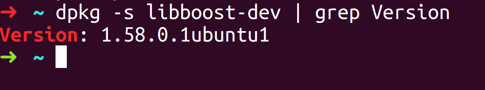
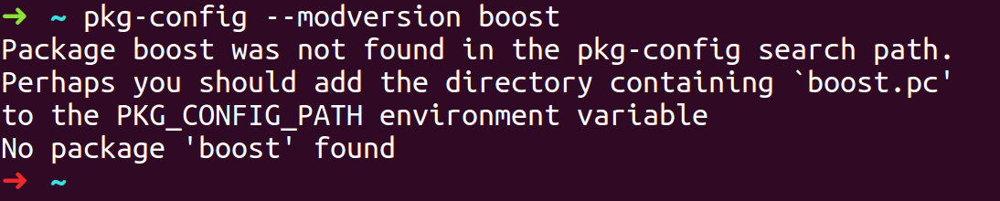
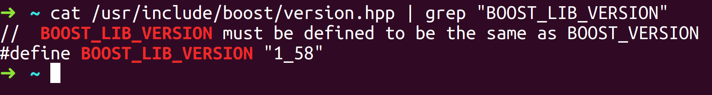

第一个问题：如何check ubuntu16.04 有没有安装boost，如果有安装，那么boost是什么版本？

方法1 - 通过dpkg

在命令行里输入 **dpkg -s libboost-dev | grep Version**

方法2 - 通过pkg-config

在命令行里输入 **pkg-config --modversion boost**

方法3 - 通过文件

cat /usr/include/boost/version.hpp | grep "BOOST_LIB_VERSION"

