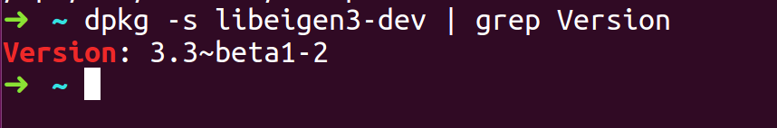
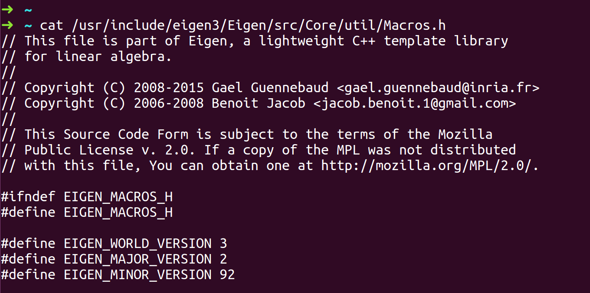

第一个问题：如何check ubuntu16.04 有没有安装eigen，如果有安装，那么eigen是什么版本？

方法1 - 通过dpkg

在命令行输入 **dpkg -s libeigen3-dev | grep Version**

方法2 - 通过pkg-config

在命令行里输入 **pkg-config --modversion eigen3**

方法3 - 通过文件

查看文件 /usr/include/eigen3/Eigen/src/Core/util/Macros.h，在我的机器上会显示如下结果：

#define EIGEN_WORLD_VERSION 3

#define EIGEN_MAJOR_VERSION 2

#define EIGEN_MINOR_VERSION 92

